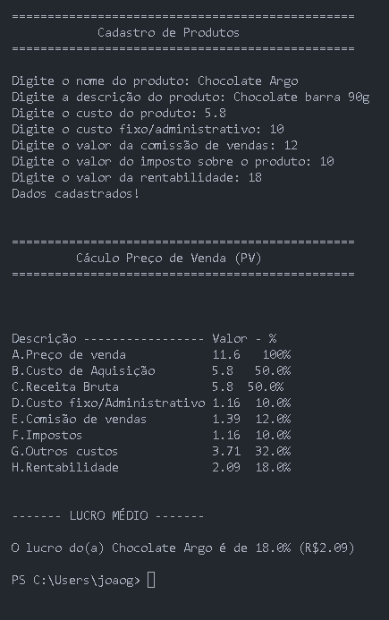

# Projeto Integrador
aula 3, 18/3/2024
<h1 align="center">Projeto Integrador - Eng. de Software</h1>

Um repositório teste para o aprendizado de git, github e cronogramas no project libre. E para gerenciamento dos arquivos do projeto integrador I.

## 🖥️ Tecnologias

  Esse projeto foi desenvolvido com as seguintes tecnologias:

  - Project Libre
  - Git e github
  - Python
  - Biblioteca Pandas

## 🚀 Projeto

  
  

<h2 align="center">
  Quer conversar comigo?
  <button style="background:#4863F7; border-radius: 999px; padding: 10px; margin: 24px 0; border: 2px solid #202020; color: white;">
    <a href="https://wa.link/j57kqg">Me mande uma mensagem!</a>
  </button>
</h2>

  Com apoio da <a href="https://www.google.com/url?sa=t&rct=j&q=&esrc=s&source=web&cd=&ved=2ahUKEwiAvLb32_2EAxVtFLkGHWfADCMQFnoECA8QAQ&url=https%3A%2F%2Fwww.puc-campinas.edu.br%2F&usg=AOvVaw27CqSDKC0Qhe6GMMnuGQXt&opi=89978449">PUC Campinas</a>

## ℹ️ Detalhes:

<h2 align="center">
  Colocar o usuário e senha do banco de dados PUC, e, caso não esteja na internet da PUC, entre pelo VPN-PUC, BD-ACD

